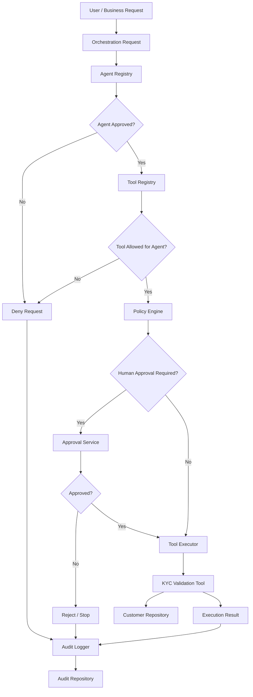
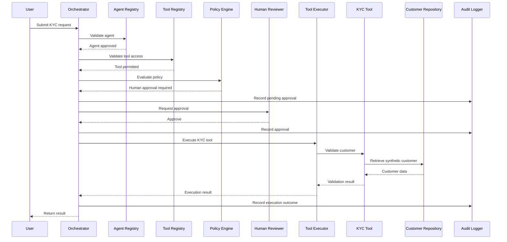

# OpenTAF KYC Reference Architecture

## Purpose

This document describes the OpenTAF KYC reference implementation and demonstrates how Agentic AI concepts can be combined with enterprise governance, controlled tool access, human approval and auditability.

The implementation uses **synthetic customer data** and is intended for architectural experimentation and demonstration.

It is not intended to make real KYC, lending, compliance or customer decisions.

---

## Reference Scenario

The example demonstrates a controlled KYC validation workflow.

A KYC Validation Agent requests access to a KYC validation tool.

Before the action is executed, OpenTAF evaluates:

* Agent identity
* Agent approval status
* Agent risk level
* Agent autonomy level
* Tool authorization
* Policy controls
* Human approval requirements
* Audit requirements

The resulting workflow demonstrates the principle of **bounded autonomy**.

---

## Architecture



---

## Core Components

### 1. Customer Repository

The example uses a local customer repository containing synthetic customer information.

The repository provides the data required by the KYC validation tool.

No real customer information should be used for the reference implementation.

---

### 2. KYC Validation Tool

The KYC validation tool represents an enterprise capability that an agent may need to invoke.

The tool is registered with OpenTAF and given explicit metadata including:

* Tool identity
* Purpose
* Risk level
* Permitted agents
* Human approval requirement

This separates **what a tool can do** from **which agents are allowed to invoke it**.

---

### 3. Agent Registry

The KYC Validation Agent is registered with the framework.

Example attributes include:

```text
Agent ID:        OTAF-KYC-001
Purpose:         Support customer KYC validation
Owner:           Customer Operations
Risk Level:      High
Autonomy Level:  L2
Status:          Approved
```

The registry provides a controlled identity and lifecycle boundary for agents.

---

## Agent Approval

An agent must be registered and approved before it can participate in the workflow.

Conceptually:

```text
Agent Request
     |
     v
Agent Registry
     |
     +---- Not Registered ----> DENY
     |
     +---- Registered
              |
              v
        Approval Status
              |
        +-----+-----+
        |           |
      Denied      Approved
        |           |
       DENY         v
                 Continue
```

This establishes a basic trust boundary before the agent can access enterprise tools.

---

## Tool Governance

The KYC validation tool explicitly identifies which agents are permitted to use it.

Example:

```text
Tool:
TOOL-KYC-VALIDATE

Allowed Agent:
OTAF-KYC-001

Risk:
HIGH

Human Approval:
REQUIRED
```

This implements a least-privilege approach to agent tool access.

An agent should not automatically receive access to every tool available within an enterprise environment.

---

## Policy Evaluation

Once the agent and requested tool have been validated, the request passes through the policy layer.

The policy layer can consider:

* Agent identity
* Requested action
* Tool identity
* Risk level
* Context
* Approval requirements
* Other governance conditions

The policy decision determines whether execution can continue.

---

## Human Approval

The reference implementation demonstrates a human approval checkpoint.

The workflow is:

```text
Agent Request
     |
     v
Policy Evaluation
     |
     v
Human Approval Required
     |
     v
Pending Approval
     |
     v
Human Review
     |
   +---+---+
   |       |
Approve   Reject
   |       |
   v       v
Execute   Stop
```

The human approval service records the decision and the reason provided by the reviewer.

This demonstrates the principle that an agent can prepare or request an action without automatically becoming the final decision authority for consequential activities.

---

## Tool Execution

After the required controls have been satisfied, the orchestrator invokes the KYC validation tool through the tool executor.

The tool performs the validation against the synthetic customer repository.

The execution result is returned to the orchestration layer.

---

## Audit Trail

Important workflow events are recorded through the audit logger.

The reference implementation records information such as:

* Event identity
* Event type
* Decision
* Outcome
* Approval activity
* Execution result

Conceptually:

```text
Request
   |
   v
Agent Validation
   |
   v
Tool Authorization
   |
   v
Policy Decision
   |
   v
Human Approval
   |
   v
Tool Execution
   |
   v
Outcome
```

Each stage can produce an auditable event.

This supports traceability of agent actions and governance decisions.

---

## Bounded Autonomy

The example illustrates bounded autonomy rather than unrestricted autonomous execution.

The agent is capable of requesting an enterprise action, but its authority is constrained by:

```text
Agent Identity
      +
Agent Approval
      +
Tool Permission
      +
Policy
      +
Risk Controls
      +
Human Approval
      +
Auditability
```

The objective is not to prevent agents from acting.

The objective is to establish **explicit boundaries within which agents can act safely and predictably**.

---

## End-to-End Sequence

The complete workflow can be represented as:



---

## Reference Implementation

The primary implementation is available at:

`examples/end_to_end_kyc_demo.py`

Related examples include:

* `examples/agent_registry_demo.py`
* `examples/policy_demo.py`
* `examples/audit_demo.py`
* `examples/kyc_tool_demo.py`
* `examples/multi_agent_kyc_demo.py`
* `examples/synthetic_customers.py`

These examples demonstrate individual components as well as the broader governance workflow.

---

## What This Demonstrates

The reference implementation demonstrates several OpenTAF architectural principles:

| Principle                 | Demonstration                    |
| ------------------------- | -------------------------------- |
| Agent identity            | Agent Registry                   |
| Controlled access         | Tool Registry                    |
| Least privilege           | Explicit agent/tool relationship |
| Risk-based controls       | Agent and tool risk levels       |
| Human oversight           | Approval Service                 |
| Policy enforcement        | Policy Engine                    |
| Controlled execution      | Tool Executor                    |
| Traceability              | Audit Logger                     |
| Synthetic experimentation | Customer Repository              |
| Bounded autonomy          | Combined governance workflow     |

---

## Limitations

This implementation is intentionally simplified.

It currently uses:

* In-memory repositories
* Synthetic data
* Demonstration services
* Simplified policy evaluation
* Local execution

It should not be interpreted as a production-ready KYC platform.

A production implementation would require additional controls including appropriate:

* Identity management
* Authentication and authorization
* Secrets management
* Data protection
* Policy enforcement
* Resilience
* Monitoring
* Security testing
* Compliance controls
* Operational governance

---

## Potential Extensions

Future experimentation could explore:

* Multiple specialised KYC agents
* Document intelligence
* OCR integration
* Risk scoring
* External policy engines
* MCP tool governance
* Persistent audit storage
* Agent evaluation
* Agent-to-agent authorization
* Human approval interfaces
* Policy-as-code
* Agent capability discovery
* Failure and recovery patterns

These extensions can be developed as independent contributions without changing the core architectural principles.

---

## Experimentation Guidance

Developers experimenting with this reference implementation should use synthetic or appropriately anonymised data.

The implementation is intended to demonstrate architectural patterns, not to provide regulatory, legal or compliance certification.

For guidance on experimentation and contribution, see:

* [Adoption & Experimentation Guide](adoption.md)
* [Technical Review Guide](review.md)
* [Contributing Guide](../CONTRIBUTING.md)
* [Security Policy](../SECURITY.md)

---

## Project Status

This is an evolving reference implementation.

The architecture is intentionally open to technical review, alternative approaches and community contribution.

Feedback that identifies architectural limitations, security concerns or opportunities for improvement is encouraged.
